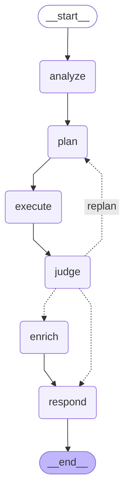

# LangGraph 노드 구성 (python -m app.agent.graph 출력)

```mermaid
---
config:
  flowchart:
    curve: linear
---
graph TD;
	__start__([<p>__start__</p>]):::first
	analyze(analyze)
	plan(plan)
	execute(execute)
	judge(judge)
	enrich(enrich)
	respond(respond)
	__end__([<p>__end__</p>]):::last
	__start__ --> analyze;
	analyze --> plan;
	enrich --> respond;
	execute --> judge;
	judge -.-> enrich;
	judge -. &nbsp;replan&nbsp; .-> plan;
	judge -.-> respond;
	plan --> execute;
	respond --> __end__;
	classDef default fill:#f2f0ff,line-height:1.2
	classDef first fill-opacity:0
	classDef last fill:#bfb6fc
    %% analyze: 의도 분석
    %% plan: 계획 수립
    %% execute: Tool 호출
    %% judge: 결과 통합·제약 판단
    %% enrich: 상세 보강
    %% respond: 최종 응답
```
